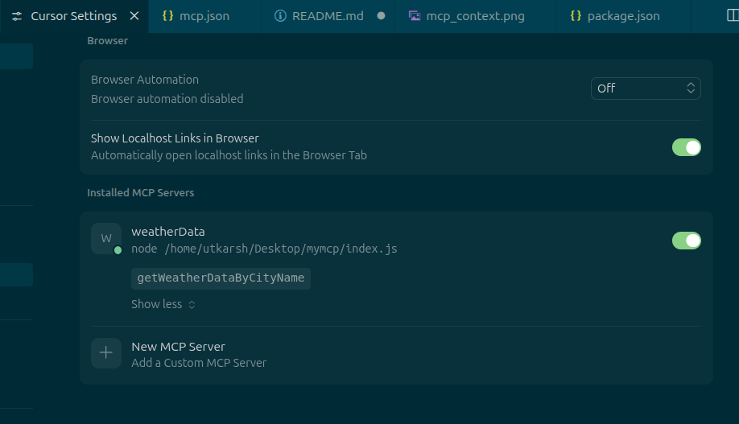
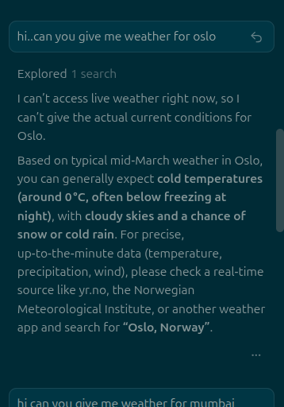
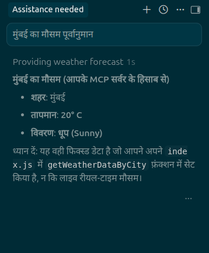
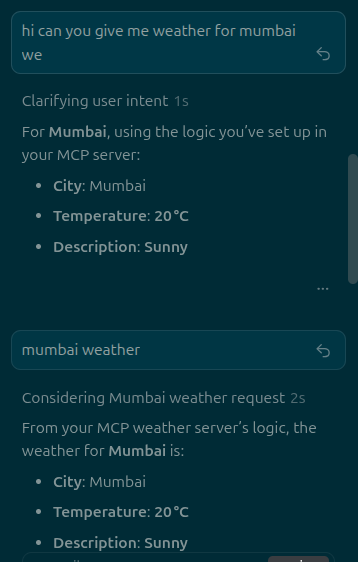

## Basic local MCP server

This project sets up a basic MCP server in the Cursor IDE and configures `mcp.json` to add simple weather data as context.

- **Custom MCP setup**  
  

- **Context limitation example**  
  In one example, we ask for the weather in a city other than Mumbai.  
  The server cannot provide details because that city is not present in the MCP context.  
  

- **Language‑independent prompting**  
  When prompting for the specific configured city (Mumbai), the MCP server returns weather data correctly, regardless of the language used in the prompt.  
    
  